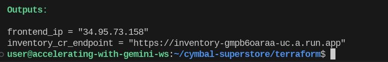

<p align="center">

</p>

Cymbal Superstore is sample grocery store web application, built with React.js
and Node.js. This sample was built to showcase
[Gemini AI Code Assist](https://cloud.google.com/gemini/docs/codeassist/overview),
including AI-assisted development, operations, and analytics.

**[Check out the blog post to learn more.](https://cloud.google.com/blog/products/application-development/how-ai-driven-software-creation-tools-speed-up-your-development)**

This is a prototype demo, with mocked components and data; it is not a
production-grade web application. This is not an official Google product. All
demo sources - including source tutorials and image licenses -
[can be found here](docs/sources.md).

<!-- TOC -->

-   [Getting Started](#getting-started)
    -   [Part 1 - Create a Cloud Workstations Cluster](#part-1---create-a-cloud-workstations-cluster)
    -   [Part 2 - Use Terraform to deploy Cymbal Superstore](#part-2---use-terraform-to-deploy-cymbal-superstore)
    -   [Part 3 - Configure Spanner](#part-3---configure-spanner)
-   [Try Gemini Code Assist](#try-gemini-code-assist)
    -   [Development](#development)
    -   [Code Generation](#code-generation)
    -   [Debugging](#debugging)
    -   [Testing](#testing)
    -   [Deploy the new feature](#deploy-the-new-feature)
    -   [Operations](#operations)
    -   [Logging](#logging)
    -   [Security Command Center](#security-command-center)
    -   [Analytics](#analytics)
    -   [BigQuery](#bigquery)
    -   [Spanner](#spanner)

<!-- /TOC -->


## Getting Started

To deploy this sample to a Google Cloud project, you will need: - A Google Cloud
project with billing enabled - Owner permissions in your project - Gemini Code
Assist activated in your project.
([Learn more](https://cloud.google.com/products/gemini/code-assist)) - Security
Command Center (Premium) activated in your project.

Then, follow these steps:

### Part 1 - Create a Cloud Workstations Cluster

To deploy Cymbal Superstore, and then interact with the codebase using Gemini
Code Assist, we use [Cloud Workstations](https://cloud.google.com/workstations),
a Google Cloud-hosted developer machine.

1.  Open the Cloud Workstations Console in your project
    https://console.cloud.google.com/workstations/
1.  Enable the Workstations API.
1.  Create a Workstation Configuration using the default base image.
1.  Create a Workstations cluster using your Configuration. (keep defaults, eg.
    VPC, subnet). This step takes about 15 minutes to complete.
1.  Create one Workstation in your cluster.
1.  Start and Launch your Workstation from the console.
1.  Inside your Workstation's editor, click **Cloud Code - Sign in.** Follow the
    steps to sign in to your GCP account.
1.  Click **Cloud Code - No Project**, then select your project.
1.  Reload the editor. You should see a Gemini AI icon in the left sidebar, as
    well as a Gemini AI indicator on the bottom-right of your editor.

### Part 2 - Use Terraform to deploy Cymbal Superstore

1.  From inside your Cloud Workstation, open a terminal.
2.  Clone this repository:

```
git clone https://github.com/GoogleCloudPlatform/cymbal-superstore
```

1.  Set your Project ID.

```
PROJECT_ID="your-google-cloud-project-id"
gcloud config set project $PROJECT_ID
```

1.  Run the Docker auth credential helper.

```
gcloud auth configure-docker us-central1-docker.pkg.dev
```

1.  Install brew.

```
sudo apt-get install build-essential procps curl file git
/bin/bash -c "$(curl -fsSL https://raw.githubusercontent.com/Homebrew/install/HEAD/install.sh)"
```

```
(echo; echo 'eval "$(/home/linuxbrew/.linuxbrew/bin/brew shellenv)"') >> /home/user/.bashrc
source ~/.bashrc
```

1.  Use brew to install Terraform.

```
brew install terraform
```

1.  Change into the `cymbal-superstore/terraform/` directory. This directory
    contains Terraform infrastructure as code, which when applied to your
    project, will deploy Cymbal Superstore.

```
cd cymbal-superstore/terraform
```

1.  In the `terraform/` directory, create a file called `terraform.tfvars`.
    Replace PROJECT_ID and PROJECT_NUMBER with your project ID and project
    number, then save the file.

`terraform/terraform.tfvars`: ``` project_id="YOUR_PROJECT_ID"
project_number="YOUR_PROJECT_NUMBER"

```

Note: You can use `gcloud` to obtain your project number: `gcloud projects describe $PROJECT_ID --format="value(projectNumber)"`.

9. Initialize Terraform.

```

terraform init ```

1.  See the resources that will be deployed.

```
terraform plan
```

1.  Deploy the Terraform resources to your project.

```
terraform apply
```

Note: this step takes about 10 minutes to complete. When successful, you will
see outputs like this — but with different values for your project.



1.  Update your frontend to talk to the backend `inventory_cr_endpoint` in your
    output. To do this, copy the value of your `inventory_cr_endpoint`, open
    `frontend/.env.production`, and replace the value of
    `REACT_APP_INVENTORY_URL`.

2.  Re-run `terraform apply`. This should only take a minute, as it will
    redeploy your frontend React app to Cloud Storage using the updated backend
    URL.

```
terraform apply
```

1.  Open your `frontend_ip` in a browser. You should see the Cymbal Superstore
    frontend.


1.  Click on **New Arrivals.** You should see a mocked list of gray product
    rectangles. This is expected; the Gemini Code Assist demo steps cover the
    backend implementation of serving this list of new products.


### Part 3 - Configure Spanner

The Spanner component of this demo is mocked - there's no web service writing
data to Spanner. Instead, we preload Spanner with mock transaction data so that
when we use Gemini in Spanner, we have some data to work with.

1.  In a terminal, open `scripts/spanner.sh`.
2.  Replace `PROJECT_ID` with your project ID.
3.  Run the script to populate the Spanner transactions database:

```bash
cd ~/cymbal-superstore/scripts
chmod +x ./spanner.sh
./spanner.sh
```

When successful, you should see a series of `commitTimestamp` log messages
indicating that the script is writing data to Spanner.

## Try Gemini Code Assist

To test out
[Gemini Code Assist in Google Cloud](https://cloud.google.com/products/gemini/code-assist)
features using this sample, try these steps.

### Development

#### Code Generation

Try implementing the GET /newproducts handler in `backend/index.ts`. Open the
file in your Cloud Workstations editor, then scroll to "DEMO TASK START" (line
94).

Add this prompt as a code comment:

```
// Get new products from Firestore (added < 7 days ago) and quantity > 0 (in stock)
```

Observe Gemini's code completion suggestions, and press `tab` to accept.
Continue pressing `tab` to accept subsequent code completion suggestions.


Alternatively, get the solution code from `scripts/solutioncode-with-bug.ts`.

#### Debugging

Using the solution code above, try running the backend server. From your Cloud
Workstations terminal, run:

```
cd cymbal-superstore/backend
npm run start
```

Then, in another terminal tab, curl the server endpoint.

```
curl localhost:8000/newproducts
```


You may see an error: `curl: (52) Empty reply from server` with a log message:
`Cannot have inequality filters on multiple properties`. This error comes from
the Firestore client library.

To debug, open the Gemini AI Chat icon (chat bubble with a diamond symbol) on
the left side of your Workstation editor. Paste in the log message and ask
Gemini to help you figure out how to fix.


Gemini's response says that Cloud Firestore does not support multiple inequality
filters in the same query. To resolve, delete the line `.where("quantity", ">",
0)` so that we only have one filter in our query.

Restart the server, and attempt to curl again. You should successfully get back
a list of products.

```
curl localhost:8000/newproducts
```

To get the solution function for this step, see
`scripts/solutioncode-bug-fixed.ts`.

#### Testing

Open `backend/index.test.ts`. Use Gemini AI chat to generate a test for the
`newproducts()` function:

```
Help me write an Express.js test using Jest, in typescript, for the GET /newproducts handler in index.ts. Should check if the response code is 200 and the list of new products is length 8.
```

Paste the `describe()..` test into index.test.ts.


#### Deploy the new feature

After using Gemini Code Assist to build the newproducts() backend feature into
the Inventory API, you can deploy that code to Cloud Run simply by re-running
`terraform apply`. This step will containerize your updated `backend/` code,
push to Container Registry, and redeploy to Cloud Run.

```
cd ~/cymbal-superstore/terraform
terraform apply
```

Now, if you hit your `frontend_ip` and click **New Products**, you should see a
list of colorful new products, delivered by your new GET /newproducts API
endpoint.


### Operations

#### Logging

Open the Google Cloud Console. Click the Gemini AI icon on the top right. In the
Chat window, ask where to find logs for the Inventory service:


Then, inside Cloud Logging, click on any individual Log message, then click
**Explain this log entry**. A Gemini AI window should appear on the right,
explaining the log message.


#### Security Command Center

Inside the Cloud Console, search for "Security Overview." Open Security Command
Center, then click **Findings** on the left side.

Click on any individual finding, then view an AI-generated summary of the
security recommendation.


Note - Security Command Center works best if you wait 1-2 days after activation,
so it can gather and surface findings. If you don't have any security findings
in your project yet, wait a few hours then try again.

### Analytics

#### BigQuery

Open BigQuery in the Cloud Console. On the left side, click the `cymbalsales`
dataset, and below that, the `cymbalsalestable`. Open a new Query window.

On the top right of the query window, you should see a Gemini AI icon (blue
magic wand). Click it to ensure that SQL Code Completion is selected:

<p align="left">

</p>

Then, try generating some SQL in the BigQuery window, using the following
prompt:

```sql
SELECT SUM(PRICE_PER_UNIT * QUANTITY_SOLD_AUG_5) AS total_aug_5,
FROM `PROJECT_ID.cymbal_sales.cymbalsalestable`;


# Get sales total_aug_12

```


Click **Run** to run your queries and view results.

#### Spanner

Open Spanner in the Cloud Console. Then, open the Explorer. Open a new query
window and start typing (eg. `SELECT ...`) to get SQL suggestions.


